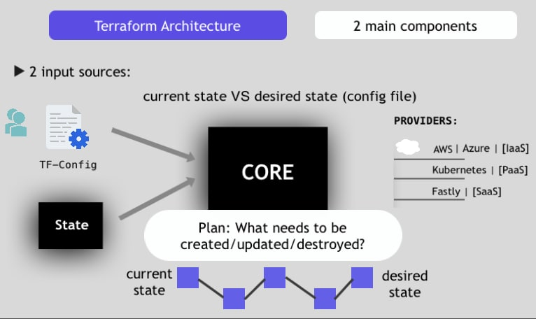

# Terraform with AWS.

In this guide we will be covering the following:

- What is Iaac (Infrastructure as a code) and Terraform.
- What they are used for.
- Terraform architecture and commands.
- Lifecycle of Terraform.
- Differences between Terraform and Anisible.
- Installation of Terraform and creation of EC2 instance using Terraform.

Youtube video: https://www.youtube.com/watch?v=OWngJ_F2Sr4&list=PLdsu0umqbb8NxoJUNup3PCb38RQpQtm9p

## What is Iaac? 
Iaac stands for Infrastructure as a code and is a process of managing and provisioning of infrastructures through code instead of using manual configurations. This is usually done with the help of tools like Terraform, Anisible, Puppet and more...

So the main aim of iaac is to enable devs and operation teams to easily automate the installation, configuration and management of their infrastructure.

## Approaches to IaC
There are two different approaches to infrastructure as code.

<b id="imperative">Imperative and Declarative</b>

### Declarative
Declarative IaC allows a developer to describe resources and settings that make up the end state of a desired system. The IaC solution then creates this system from the infrastructure code. This makes declarative IaC simple to use, as long as the developer knows which components and settings they need to run their application.

### Imperative
Imperative IaC allows a developer to describe all the steps to set up the resources and get to the desired system and running state. While it isn’t as simple to write imperative IaC as declarative IaC, the imperative approach becomes necessary in complex infrastructure deployments. This is especially true when the order of events is critical.

In simple form a declarative approach you just give the output you want and terraform handles the rest while in the imperative approach you describe what you want before arriving to the final output.

## What is Terraform?
Terraform is an open source automation tool developed by Hashicorp in Go language. This tool is used to implement iaac (Infrastructure as a code). It is supported by multiple cloud infrastructure providers like AWS, MS AZURE, IBM CLOUD, DIGITAL OCEAN, GOOGLE CLOUD etc.

## Use cases of Terraform.
1. Managing of existing Infrastructure.
2. Creation of new Infrastructure.

## Terraform Architecture.
Terraform architecture is made up of two main components which are:
- The Core
- The Provider
   
   
    


### Important points:
- The core uses two inputs which are the TF-Config and the State. 
- In the TF-Config you need to write what infratructure you are expecting or what infrastructure has to be created. 
- The state is used to store the current infrastructure of your environment. 
- The core then compares the current requirement defined in the TF-Config file with the actual state of the infrastructure and based on that will create an execution plan that will decide if we need to add or delete or abide an infastructure.
- Finally, the core execute the plan we the providers (AWS, AZURE etc) to create the infrastructure.

Note: The desired state is what we have in the TF-Config file and the current state is the State.

## Terraform Commands.

Example:

Desired state:
```Terraform
# Configure the AWS provider
provider "aws" {
    region = "us-east-1"
    version = "~> 2.0"
}

# Define an EC2 instance resource
resource "aws_instance" "my_web_server" {
    # Set the AMI (Amazon Machine Name)
    ami = "ami linux 2023"
    instance_type = "t2.micro"

    # Configure tag for the instance
    tags = {
        Name = "My Web Server"
    }
}
```

## Commands
- refresh: Query infrastructure provider to get current state.
- Plan: create an execution plan.
- Apply: Execution plan: create resources.
- Destroy: Destroy the resorces.

## Differences between Terraform and Anisible.
1. Terraform
- Terraform is used for initial provision and configuration of infrastructure.
- Terraform is declarative and imperative as explained above <a href="#imperative">click here</a>
- Terraform is perfect for configuring cloud infrastructures.
- Using terraform we can deploy resources like VPCs, Load Balancers, EC2 instances etc.

2. Anisible.
- Anisible is used for configuration management and application deployment.
- Anisible is imperative (step by step instructions).
- Anisible is perfect for traditional automation.
- Using Anisible one can deploy applications at the top of the infrastructure.

NB: Traditional automation involve writing script to automate manual stuff.

## Installation of Terraform.
To install Terraform you can use the following steps.

1. Download Terraform zip file using the command below:
```bash
curl https://releases.hashicorp.com/terraform/1.8.4/terraform_1.8.4_linux_amd64.zip -o terraform.zip
```

2. Extract the zip file using:
```bash
unzip -u terraform.zip
```

3. Move the extracted file to the location /usr/local/bin directory using:
```bash
sudo mv terraform /usr/local/bin
```

4. Check if the installation was successfull.
```bash
terraform --version
```

